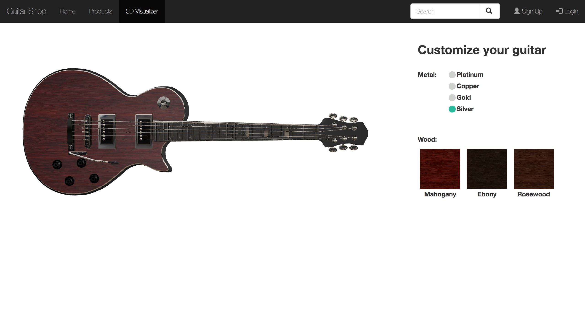
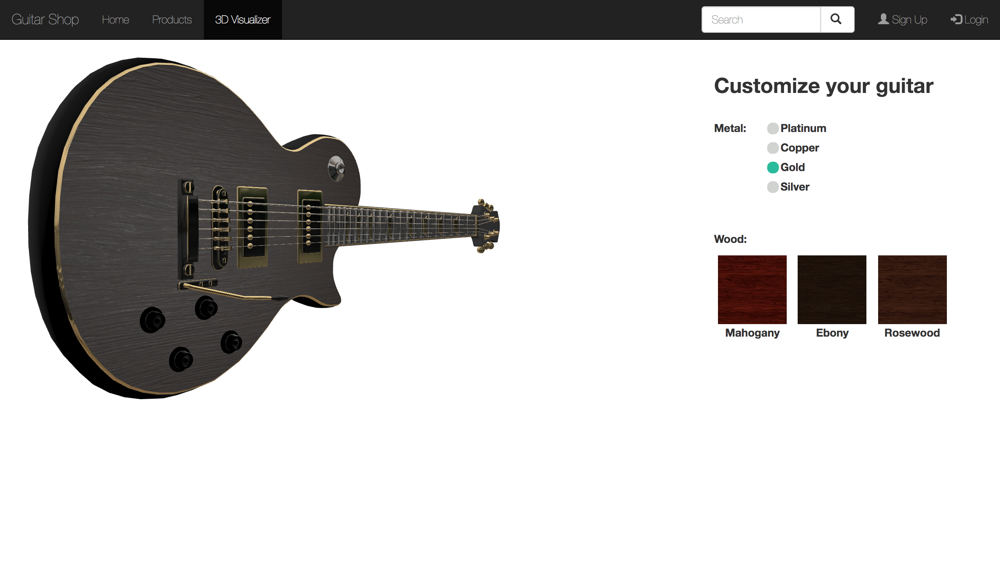

# Guitar 3D Visualizer - Report

## Descrizione generale
Per la realizzazione del *Product Visualizer*, ho deciso di mantenere un layout semplice contenente solo l'essenziale, mi sono quindi ispirata a questa [demo 3D](https://threekit.com/3d-product-demos/mens-polo-shirt-clothing/).

Il modello scelto è una [chitarra elettrica](https://sketchfab.com/models/7ab6e59ba93b46bd8afa981fef92f114) in cui è possibile modificare il tipo di legno del corpo e il metallo di alcune sue componenti.

I file utilizzati sono i seguenti: 
- **index.html**: è il file principale, contiene il codice di tutto il progetto.
- **modello**:
	- **scene.gltf**: contiene il modello della chitarra elettrica.
- **librerie**:
	- **GLTFLoader.js**: loader per modelli in formato glTF
	- **TGALoader.js**: loader per texture in formato TGA
	- **OrbitControls.js**
	- **three.min.js**
- **texture**: 
	- **cubemap**: utilizzata come environment map ([http://www.humus.name/index.php?page=Cubemap&item=Yokohama](http://www.humus.name/index.php?page=Cubemap&item=Yokohama)).
	- **materiali**: i diversi tipi di legno sono stati presi dal sito [https://www.gametextures.com](https://www.gametextures.com).

## Scelte progettuali
Per ottenere materiali più realistici, ho utilizzato una cubemap come environment map ma, volendo mantenere uno stile pulito della pagina web, e visto il tipo di modello scelto come soggetto, ho deciso di mantenere lo sfondo bianco invece di mostrare la cubemap adoperata. Per tale ragione, non ho applicato IEM perché i colori delle riflessioni sul modello sarebbero risultati "errati".

### Scelta dei materiali
Nel *Product Visualizer* ho deciso di rendere personalizzabile solo alcuni materiali della chitarra:
- corpo: è possibile scegliere il tipo di *legno* tra mogano, ebano e palissandro;
- parti metalliche: riguardano principalmente meccaniche, capotasto, tastiera, pickup, ponte e tremolo; si può scegliere il tipo di *metallo* tra platino, rame, oro e argento.

Per il resto della chitarra ho utilizzato i seguenti materiali: 
- *plastica* per le manopole;
- *cromo* per i tasti;
- *nickel* per le corde;
- *metallo nero* per alcune parti del ponte.

Il modello scelto possiede una mappatura delle UV solo nella parte anteriore e posteriore del corpo della chitarra. Al manico e al bordo del corpo, non essendo mappati, non ho potuto applicare delle texture per simulare un materiale complesso; ho quindi deciso di utilizzare un materiale diffusivo opaco.

### Scelta delle BRDF
Per la realizzazione dei materiali sono state utilizzate le equazioni illustrate durante il corso. Nello specifico, i materiali sono stati realizzati con le seguenti tecniche: 
- legno: diffuse map, specular map, roughness map e normal map.
- metallo: specular reflection (utilizzata environment map e scelto livello mipmap da usare in base alla roughness).
- plastica: combinazione di BRDF Lambertiana e BRDF Cook-Torrance.
- lambert: BRDF Lambertiana.

### Scelta del tipo di illuminazione
Per quanto riguarda l'illuminazione della scena, ho deciso di utilizzare tre `PointLight` disposte nel seguente modo: 
1. Luce frontale: `(0.0, 0.00, 6.0)`
2. Luce posteriore destra: `(8.0, 4.0, -6.0)`
3. Luce posteriore sinistra: `(-8.0, 4.0, -6.0)`

### Svolgimento del progetto
Il progetto è stato svolto seguendo i seguenti passi: 
- ricerca e scelta del modello su [Sketchfab](https://sketchfab.com/);
- inserimento della cubemap;
- stesura degli shader per i materiali; 
- creazione del form per la personalizzazione dei materiali;
- aggiunta di materiali alternativi selezionabili tramite il form;
- aggiunta delle luci;
- creazione del layout della pagina web utilizzando [Bootstrap](http://getbootstrap.com);
- correzione dei materiali e della posizione delle luci.

## Risultato

